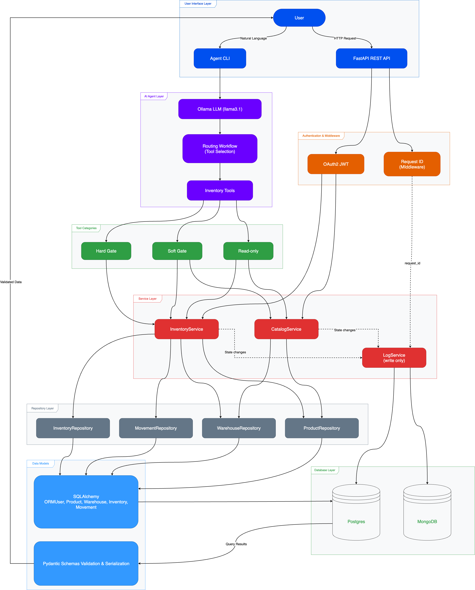
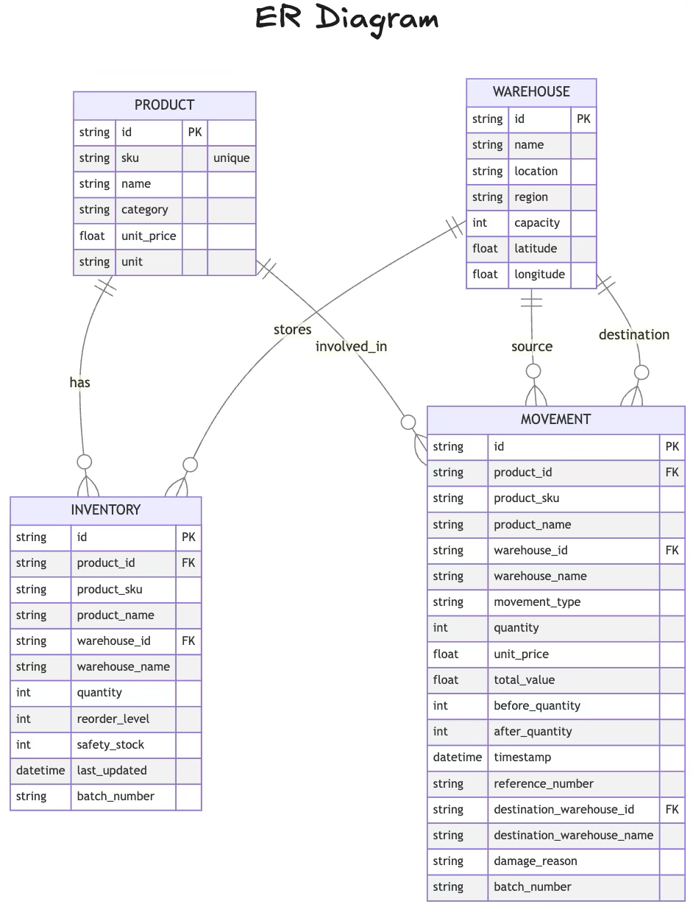

# SmartSupply: Hybrid-DB Supply Chain AI Agent API

## Project Overview
SmartSupply is a robust FastAPI microservice designed to transform how supply chain managers interact with data. By integrating **PostgreSQL** for transactional inventory management and **MongoDB** for flexible audit logging, it provides a reliable and scalable foundation. The core of SmartSupply is a **Routing Workflow AI Agent** that empowers users to query stock levels, manage inventory, and report anomalies using natural language through intelligent tool selection.

## Architecture Workflow
<p align="center">
  
</p>

## Database Schema (PostgreSQL)

> ⚠️ **Note:** The data shown in this diagram is **synthetic (fake)** and was **generated using a Python script** for development and demonstration purposes only.



## Dataset Statistics
The PostgreSQL database is seeded with the following synthetic data:
*   **Products**: 22
*   **Warehouses**: 4
*   **Inventory Records**: 88
*   **Movement History**: 320 records

## Key Features
- **🤖 AI Agent Interface**: Natural language inventory management via LangChain routing workflow agent (Ollama LLM)
- **Secure Access**: User Authentication via OAuth2 (JWT) with password hashing.
- **Request Tracing**: Unique `request_id` generated per request for complete audit trail correlation.
- **Gate-Based Access Control**: 12 specialized tools with read-only, soft-gate, and hard-gate permission levels
- **Batch-Level Inventory**: Tracks stock by batch number to ensure traceability and expiry management.
- **FIFO Logic**: Automatically enforces First-In-First-Out for stock deduction when no batch is specified.
- **Catalog Management**: Full API support (`POST/GET`) for creating and managing Products and Warehouses.
- **Movement Tracking**: Detailed logs of every inventory change (Inbound, Outbound, Transfer, Adjustments).
- **Event Logging (MongoDB)**: Immutable audit logs for all state-changing operations and conversation history.
- **Low Stock Alerts**: Built-in query methods to identify items below reorder/safety levels.
- **Movement History**: Query movement records by product SKU or warehouse name.

## Hybrid Database Architecture

SmartSupply uses **PostgreSQL** as the "Source of Truth" for current state (Inventory, Users) and **MongoDB** as the "System of Record" for history (Audit Logs).

### MongoDB Collections
1.  **`conversation_logs`**: Traces User <-> Agent interactions (Intent, Tool Selection, Result).
2.  **`audit_logs`**: Immutable record of all inventory and catalog changes.
    *   **Traceability**: Every batch movement is logged strictly with `before` and `after` quantities.
    *   **Request Correlation**: All logs include `request_id` for end-to-end tracing.
    *   **Scope**: Covers `create_product`, `create_warehouse`, `inbound`, `outbound`, `transfer`, and `damage` events.

## AI Agent Tools

SmartSupply implements a **Routing Workflow** pattern where the AI agent intelligently selects the appropriate tool based on user intent. The tools layer (`app/tools/`) provides **12 specialized functions** that wrap service layer methods with gate-based access control.

### Tool Categories by Gate Type

#### **Read-Only Tools** (6 tools - No confirmation required)
- `query_inventory_stock`: Check total stock levels (aggregate or by warehouse)
- `query_inventory_details`: Get detailed inventory records with batch info and warehouse breakdown
- `query_low_stock_items`: Identify products below reorder/safety stock levels
- `query_movement_history`: View transaction history filtered by product or warehouse
- `query_product_catalog`: Look up product information or browse full catalog
- `query_warehouse_catalog`: Look up warehouse details or list all locations

#### **Soft Gate Tools** (3 tools - Awareness confirmation)
- `create_product`: Add new products to the catalog
- `create_warehouse`: Register new warehouse locations
- `adjust_inventory_inbound`: Receive stock shipments (increases quantity)

#### **Hard Gate Tools** (3 tools - Strict confirmation required)
- `report_inventory_anomaly`: Log damage, theft, or expiration (creates audit trail)
- `adjust_inventory_outbound`: Ship stock from warehouses (FIFO logic)
- `transfer_inventory`: Move stock between warehouse locations (FIFO logic)

### Tool Response Format
All tools return a consistent `ToolResponse` schema:
```python
{
    "success": bool,
    "data": Any,
    "message": str,
    "gate_type": "read_only" | "soft_gate" | "hard_gate"
}
```

## AI Agent Implementation

SmartSupply implements a **LangChain Routing Workflow Agent** that interprets natural language queries and intelligently selects from 12 specialized inventory tools.

### Architecture Components
- **`agent_setup.py`**: Agent factory using Ollama (`llama3.1`) with configurable temperature and system prompts
- **`agent_example.py`**: Interactive REPL for testing agent conversations
- **`langchain_tools.py`**: LangChain `@tool` decorators wrapping inventory functions for agent discovery
- **`inventory_tools.py`**: Core tool implementations with enhanced docstrings for LLM understanding

### Agent Behavior
- **Read-Only Tools**: Execute immediately without confirmation
- **Soft Gate Tools**: Request user awareness before proceeding
- **Hard Gate Tools**: Require explicit user confirmation and explain impact

### Current Status
✅ **Working**: Catalog browsing, exact-match queries, stock reporting, category filtering  
⚠️ **Limitations**: See Known Limitations section below

## Known Limitations

Based on initial testing with 20+ queries, the following limitations have been identified:

### 🚨 Critical Issues
1. **Exact Name Matching Required**
   - Agent requires exact SKU and warehouse names (e.g., "Memphis Distribution Center" not "Memphis")
   - No fuzzy matching or alias support
   - Users must browse catalog first to find correct entity names

2. **Error Handling Gaps**
   - Some queries fail with `'NoneType' object has no attribute 'id'` errors
   - Technical exceptions exposed to end users instead of friendly messages
   - Missing null checks in service layer methods

3. **Response Formatting**
   - Complex queries (e.g., movement history) return raw JSON dumps
   - Lack of natural language synthesis for large result sets
   - No automatic summarization for 50+ records

### ⚠️ Medium Priority Issues
4. **Missing Catalog Discovery Flow**
   - Agent doesn't auto-suggest alternatives when exact match fails
   - No "did you mean?" functionality for typos or partial names

### Recommendations
- **Short Term**: Add defensive null checks, improve error messages, implement fuzzy matching
- **Medium Term**: Enhance LLM prompts for better response formatting and auto-suggest logic
- **Long Term**: Add semantic search for product/warehouse lookup

> 📋 **Full Analysis**: See `docs/agent_analysis_report.md` for detailed test results and root cause analysis.

## Project Structure

The project follows a clean, modular architecture:

```
src/
└── app/
    ├── agent/          # AI Agent Implementation (LangChain)
    │   ├── agent_setup.py     # Agent factory & system prompts
    │   └── agent_example.py   # Interactive REPL for testing
    ├── core/           # Security & Config (JWT, Hashing)
    ├── database/       # Database connection (PostgreSQL + MongoDB)
    ├── models/         # SQLAlchemy ORM models (User, Inventory, etc.)
    ├── routers/        # API Endpoints (Auth, User, Catalog, Inventory, Movement)
    ├── repositories/   # Data access layer
    ├── schemas/        # Pydantic validation models
    ├── services/       # Business logic (CatalogService, InventoryService, LogService)
    ├── tools/          # AI Agent Tools Layer
    │   ├── inventory_tools.py  # 12 core tool implementations
    │   ├── langchain_tools.py  # LangChain @tool decorators
    │   └── schemas.py          # ToolResponse & validators
    └── utils/          # Utilities
```

### Key Components

*   **Security Layer**:
    *   `auth_router`: Handles Login (`/login`) and Registration (`/register`).
    *   `security.py`: Manages JWT creation and `bcrypt` password hashing.
    *   `dependencies.py`: Provides `get_current_active_user` to specific protect routes.
*   **Service Layer**: The core business logic residing in `supply_service.py`.
    *   `InventoryService`: Handles stock movements, FIFO logic, batch validation, and advanced queries.
        *   Stock queries: `get_stock()`, `get_inventory_record()`, `get_low_stock()`
        *   Movement history: `get_movements_by_sku()`, `get_movements_by_warehouse()`
    *   `CatalogService`: Manages product creation and warehouse lookups.
    *   `LogService`: Write-only service that safely pushes immutable events to MongoDB (all methods require `request_id`).
*   **Agent Layer**: LangChain conversational agent implementation in `agent/`.
    *   `agent_setup.py`: Agent factory using Ollama (`llama3.1`) with system prompts for gate-based workflow.
    *   `agent_example.py`: Interactive command-line REPL for testing agent conversations.
*   **Tools Layer**: AI agent routing workflow implementation in `tools/`.
    *   `inventory_tools.py`: 12 wrapper functions organized by gate type (read-only, soft gate, hard gate).
    *   `langchain_tools.py`: LangChain `@tool` decorators for agent tool discovery.
    *   `schemas.py`: Pydantic input validators and ToolResponse schema.
    *   Functions wrap service layer methods with enhanced docstrings for LLM tool selection.
*   **Middleware**:
    *   `RequestIDMiddleware`: Generates unique `request_id` for each request, returned in `X-Request-ID` header.
*   **Routers**:
    *   `catalog_router`: Manage Products and Warehouses (Protected).
    *   `inventory_router`: Query stock levels (Protected).
    *   `movement_router`: Execute transfers and adjustments (Protected).

## How to Run

### Prerequisites
1.  **Install Ollama**: Download from [ollama.ai](https://ollama.ai) for local LLM inference
2.  **Pull LLM Model**:
    ```bash
    ollama pull llama3.1
    ```
3.  **Install Dependencies**:
    ```bash
    pip install -r requirements.txt
    ```

### Running the FastAPI Server
1.  **Start the Server**:
    ```bash
    uvicorn main:app --reload
    ```
    The API will be available at `http://localhost:8000`. API Docs at `http://localhost:8000/docs`.

2.  **Authentication Usage**:
    *   **Register**: POST to `/register` with email and password.
    *   **Login**: POST to `/login` (form-data) to get a Bearer Token.
    *   **Access API**: Include the token in the `Authorization` header (`Bearer <token>`) for all Inventory/Catalog requests.

### Running the AI Agent (Interactive)
1.  **Start Agent REPL**:
    ```bash
    python3 -m app.agent.agent_example
    ```
2.  **Chat with Agent**:
    ```
    You: Show me all products in the catalog
    Agent: There are currently 23 products available...
    
    You: What's the stock for Doritos at Memphis Distribution Center?
    Agent: There are currently 1036 units of Doritos (DOR-001) available...
    
    You: exit
    ```

> 💡 **Tip**: Use exact product SKUs (e.g., `DOR-001`) and full warehouse names (e.g., `Memphis Distribution Center`) for best results. See Known Limitations section for details.